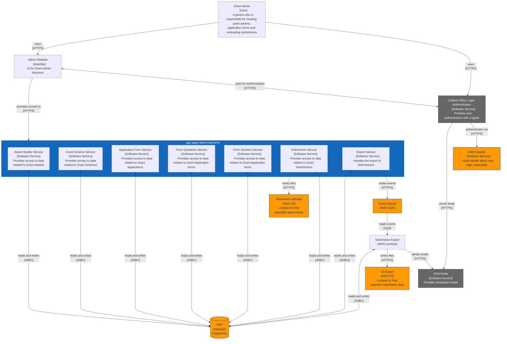

# gap-apply-admin-backend

This is the repository for the GAP projects apply for a grant admin journey backend. The backend is a spring boot API
which communicates with a PostgreSQL database, a SQS queue, S3 buckets and Contentful.

## Starting the app (Dev)

The Apply for a Grant admin backend is a maven project. This means to run the app locally you must have Maven installed
and setup on your machine. For this app's other dependencies, please see the [dependencies section](#Dependencies). Once
all dependencies and Maven is set up, you can start the app locally by running a simple maven command:

```
mvn spring-boot:run
```

### Login

Since adding Spring Security, you must be authenticated to access any of the endpoints (excluding `/health`
and `/login`).
Before you can make your requests via Postman or the FE, you will to authenticate via login endpoint to create a
session. Login requires a valid JWT signed by COLA that has not expired provided in an Authorization header as a Bearer
token.
For local development purposes, there are three properties in `application.properties` that you can set to log in as a
given user without a valid JWT.

By setting `debug.ignore-jwt` equal to `true`, the app will no longer look for a JWT and will instead log you in as an
admin with the following two properties (grantAdminId and funderId). These should match with an admin that already
exists in the database.

```
debug.ignore-jwt=false
debug.grant-admin-id=1
debug.funder-id=1
```

**Please be careful not to commit any local changes you make to these properties**

## Testing the app

Tests can typically be run through your IDE, or through maven. Here are some handy Maven commands to get you started
with testing this app.

**Run all tests:**

```
mvn test
```

**Run a single test class:**

```
mvn Test -Dtest=className
```

**Run a single test:**

```
mvn Test -Dtest=className#methodName
```

## Troubleshooting

### MapStruct Mapper Implementation Not Found

If you encounter an error like:

```
Parameter X of constructor in ...Service required a bean of type '...Mapper' that could not be found.
```

This typically means MapStruct hasn't generated the mapper implementation classes. MapStruct generates these during compilation.

**Solution:**

1. **Clean and rebuild the project:**
   ```bash
   mvn clean compile
   ```
   
   Or in your IDE:
   - **IntelliJ IDEA**: Build → Rebuild Project
   - **Eclipse**: Project → Clean → Clean all projects

2. **Verify annotation processing is enabled:**
   - **IntelliJ IDEA**: Settings → Build, Execution, Deployment → Compiler → Annotation Processors → Enable annotation processing
   - **Eclipse**: Project Properties → Java Compiler → Annotation Processing → Enable annotation processing

3. **Check for compilation errors:** If there are any compilation errors in mapper interfaces or related DTOs, MapStruct won't generate the implementation classes. Check the compiler output for errors.

After a successful build, you should see generated mapper implementations in:
```
target/generated-sources/annotations/gov/cabinetoffice/gap/adminbackend/mappers/
```

### Flyway Migration Checksum Mismatch

If you encounter an error during deployment like:

```
Migration checksum mismatch for migration version X.XX
-> Applied to database : -336000449
-> Resolved locally : -252574045
Either revert the changes to the migration, or run repair to update the schema history.
```

This occurs when a migration file has been modified after it was already applied to the database. Flyway validates checksums to ensure migration files haven't been changed.

**Important:** Never modify migration files after they've been deployed to any environment. If you need to change something, create a new migration file instead.

#### Solution Options

**Option 1: Use Flyway Repair (Recommended)**

Enable Flyway repair mode temporarily in your deployment configuration:

```properties
spring.flyway.repair=true
```

Then restart the application. Flyway will repair all checksums to match the current migration files. After the repair completes, remove this property.

**Option 2: Manually Update Checksum in Database**

If you have direct database access, you can manually update the checksum in the `flyway_schema_history` table:

```sql
-- Connect to your database and run:
UPDATE flyway_schema_history 
SET checksum = <new_checksum>  -- Use the checksum from the error message
WHERE version = '<version>';
```

**⚠️ Warning:** Only update the checksum if you're certain the migration file changes don't affect the database schema. If the migration was modified to change the schema, you may need to create a new migration to apply those changes instead.

**Option 3: Use Flyway CLI Repair Command**

If you have access to run commands on your deployment environment:

```bash
flyway repair -url=jdbc:postgresql://<your-db-host>:5432/<database-name> \
  -user=<username> -password=<password> \
  -locations=filesystem:src/main/resources/db/migration
```

#### Prevention

- **Never modify migration files** after they've been applied to any environment
- If you need to change something, **create a new migration file** instead
- Use version control to track migration history
- Consider using `spring.flyway.validate-on-migrate=true` (already enabled) to catch these issues early

## System Context Diagram


## Dependencies

### PostgreSQL & pgAdmin

gap-apply-admin-backend now uses PostgreSQL as its primary data store. This mean to start the app locally you must first
have a local postgreSQL database running with the correct properties added within application.properties.

[Entity Relationship Diagram](docs/entity-relationship-diagram.md)

#### Setup PostgreSQL with Docker

PostgreSQL and pgAdmin can be easily setup easily through the use of docker compose. A suitable docker-compose.yml file
can be found at `/src/main/resources/Docker`.
A local instance of PostgreSQL and pgAdmin can be started by navigation to /src/main/resources/Docker within a terminal
and running:

```
docker compose up -d
```

#### Connecting pgAdmin to PostgreSQL database

With the above containers running, pgAdmin can be found at [http://localhost:5050](http://localhost:5050).
This presents you with a login page, the credentials for which can be found in the docker compose file
but the default is:

- email: admin@email.com
- password: root

Once in, follow the below steps to connect to your local DB:

- Right click on servers, then register > server
- Give a name to your new server group
- Click on connection tab
- Set Host name/address to the postgres container name
    - The default within the file is pg-gap-admin
- Set username and password to the credentials found within the docker compose file
    - The default credentials within the file are: root

#### Setup PostgresSQL schemas using Flyway

To maintain database synchronisation across environments, we are using Flyway to handle database setup/migration.
Spring will automatically run new migrations on start up, but this can also be done manually through maven.
Credentials needed by Flyway are stored in `pom.xml`, within Flyway's plugin definition.
SQL scripts are stored in `src/main/resource/db/migration` and to run the migration setup
using Maven run the following command:

```
mvn flyway:migrate
```

This will run all scripts in the directory listed above. Migration history is automatically stored in a table called
`flyway_schema_history`. This means that whenever a new script is added to the directory, and you run the Maven migration
command again, it will only run the new script. Therefore, once the database is established and deployed
in long-term environments, when making changes to schemas, you do not modify existing scripts that have already
been migrated - you must add new scripts. A more eloquent explanation and example is provided
[here](https://flywaydb.org/documentation/getstarted/why).

For test data, in the directory `src/main/resource/db/` there is a file named `testdata.sql` which you can use to
manually populate your database for development purposes. You can use PGAdmin to run the contents of the script.
**Please do not add test data to the SQL scripts used by Flyway**, as these are intended to be used by all
environments (incl. production).

## Formatting

To enforce consistent formatting across IDEs, we are using Spring's own Java formatting plugin.
To run the formatter, you can run:

```
mvn spring-javaformat:apply
```

Or to validate the codebase against the formatter, you can run:

```
mvn spring-javaformat:validate
```

This validate step is included in Maven build phase, so if the code does not pass validation, the build will fail.
There are plugins you can install for IntelliJ and Eclipse which allows the IDE reformat to utilise the same rules,
hopefully keeping everyone in sync.

**NOTE: It's recommended you configure your IDE to reformat your code automatically, either when you save a file or make
a commit.**

### IntelliJ

1. Download the plugin
   from [here](https://repo1.maven.org/maven2/io/spring/javaformat/spring-javaformat-intellij-idea-plugin/0.0.34/spring-javaformat-intellij-idea-plugin-0.0.34.jar)
   (it can't be installed through the plugin Marketplace).
2. Go to IntelliJ's settings (preferences) and find the Plugins section.
3. Along the top of the Plugins section (where it says Marketplace and Installed), click the cog and select Install
   Plugin from Disk.
4. Select the .jar you downloaded in step 1

### Eclipse

1. Download the plugin
   from [here](https://repo.spring.io/artifactory/release/io/spring/javaformat/io.spring.javaformat.eclipse.site/0.0.34/io.spring.javaformat.eclipse.site-0.0.34.zip)
   (it can't be installed through the Eclipse Marketplace).
2. Navigate to Help > Install New Software.
3. On this window, click the Add button along the right-hand side.
4. In the next window, click Archive and select the zip file you downloaded in step 1.
5. You may be asked to install an unauthorised plugin, due to it not coming directly from the Marketplace. Tick the
   plugin and click accept.
6. In Eclipse's settings (preferences), navigate to Java > Code Style > Formatter.
7. Change the formatter implementation to `Spring (spaces)`.

## AWS

To use the `/submissions/export-all` endpoint that interacts with AWS SQS, you will need to add AWS credentials to the
following file: `~/.aws/credentials`

The `credentials` file requires the following entries:

```shell
[default]
aws_access_key_id = {your access key - if you don't have any, leave blank} 
aws_secret_access_key = {your secret key - if you don't have any, leave blank}

```

The `config` file requires the following entry:

```shell
[default]
region = eu-west-2
```

By default, your own credentials will not work unless you explicitly give them permission on the affiliated SQS queue.
The service account has access to send messages to SQS, so it is recommended to use that profile (it's already set
in `application.properties`). If you don't have service account credentials, speak to Chris Steele about details of the
service account for this purpose.
