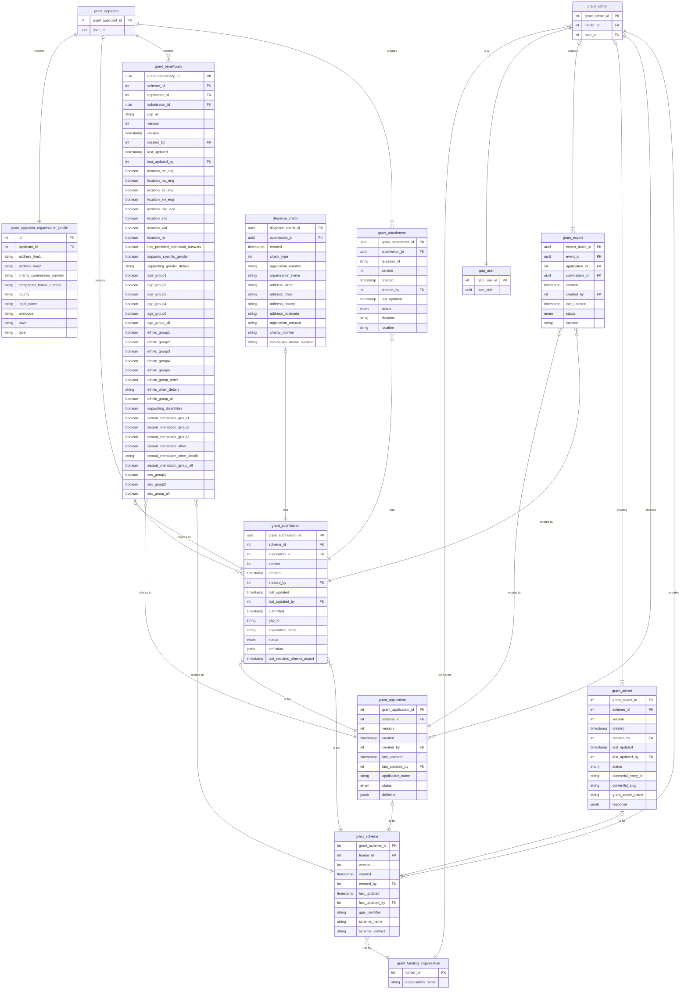

# Entity Relationship Diagram

The GAP project relies on a PostgreSQL database for all its internal data storage. In addition, it makes use of Contentful CMS and AWS S3 for further storage.

## PostreSQL Database

